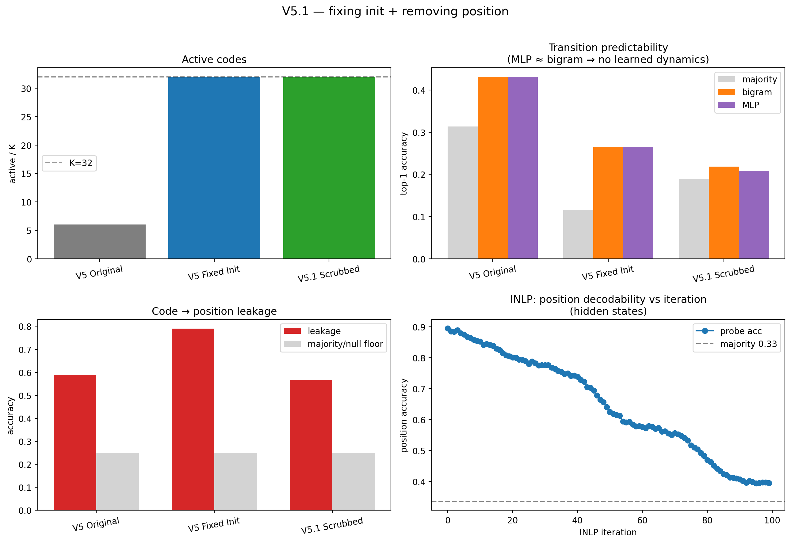

# V5.1 — Final Report (Discrete State Discovery)

> **Research question:** do hidden-state trajectories of a frozen language model admit a compact, predictive, *reusable* discrete state representation?

> Model: TinyLlama · Task: Countdown · States: last-layer hidden states at reasoning-step boundaries · Codebook K=32.

---

## Why the original V5 result is invalid

The original VQ codebook was initialized as `randn * 0.02` (row-norm ≈ 0.90) while the hidden states have norm ≈ 85 — a ~94× scale mismatch. On the first batch almost every state maps to one code; EMA + dead-code revival cannot recover, leaving **6/32 active codes**. The collapse is an initialization artifact, not a property of the representation. Data-dependent init (random training states) restores full codebook usage.

## Comparison table

| Metric | V5 Original | V5 Fixed Init | V5.1 Scrubbed |
| --- | ---: | ---: | ---: |
| Active Codes | 6 | 32 | 32 |
| Gini | 0.854 | 0.371 | 0.484 |
| Perplexity | 5.33 | 25.68 | 21.22 |
| Position Leakage | 0.588 | 0.790 | 0.567 |
| Majority Baseline | 0.313 | 0.116 | 0.189 |
| Bigram Baseline | 0.431 | 0.265 | 0.218 |
| MLP Accuracy | 0.431 | 0.265 | 0.208 |
| Global Entropy | 1.197 | 1.772 | 2.417 |
| Deterministic Fraction | 0.000 | 0.000 | 0.031 |

_V5 Original source: re-derived from saved original collapsed code trajectories._ Leakage majority/null floors: Original 0.251/0.090, Fixed 0.251/0.124, Scrubbed 0.251/0.112.

**Central pattern — MLP ≈ bigram in every column** (Original 0.431/0.431, Fixed 0.265/0.265, Scrubbed 0.208/0.218 as MLP/bigram): the learned next-code MLP never improves on a first-order count model, in any condition. The original report's headline (MLP 0.431 vs uniform-chance 0.031, a ~14× gap) compared against the wrong baseline; against the honest bigram the gap is ≈ 0.

**Entropy caveat:** global entropy *rises* across columns (1.197 → 1.772 → 2.417), but this is a de-collapse artifact — with 6 codes there are few possible successors, with 32 there are many. The decisive diagnostic is the deterministic-successor fraction, which stays ≈ 0 (0.000 / 0.000 / 0.031): no near-deterministic 'planning' states appear in any condition.

## Position subspace (continuous hidden states)

- Position probe (4 relative-depth bins): **0.896** held-out vs majority 0.335 (4 classes). Trajectory stage is almost perfectly linearly decodable from a raw hidden state.

- INLP removed **300 dims** over 100 iterations: position decodability **0.896 → 0.390** (majority floor 0.335).

**INLP curve — position is high-dimensional and redundant:**

| dims removed (≈3·iter) | position accuracy |
| ---: | ---: |
| 0 | 0.896 |
| 57 | 0.805 |
| 117 | 0.743 |
| 177 | 0.579 |
| 237 | 0.484 |
| 297 | 0.396 |

_The spec's 6–8 iterations remove only ~24 dims (acc still 0.864); reaching the floor needs ~300 dims. That position resists removal until ~15% of the hidden space is deleted is itself evidence that these states are dominated by trajectory stage._

---

## Final analysis

### Q1 — Does fixing initialization invalidate the original collapse conclusion?

**Yes.** With data-dependent init the codebook goes from 6/32 active codes (Gini 0.854) to 32/32 (Gini 0.371). The reported collapse was an init artifact and must not be cited as evidence about the representation.

### Q2 — Does position scrubbing reveal stronger latent structure?

**No.** Even after near-complete removal of linearly-decodable position (continuous-state decodability 0.896 → 0.390, floor 0.335; 300 dims), the codes still leak position at 0.567 (floor 0.251), and the MLP (0.208) does not beat the bigram (0.218) — margin -0.010. No reusable low-entropy dynamics appear; the deterministic-successor fraction stays 0.031.

### Q3 — After controlling for init and position, the states are:

**B + C — trajectory-stage encodings with only weak local (first-order) dynamics.** Two signatures coincide: the codes still track trajectory position (leakage 0.567 ≫ floor 0.251) even after the continuous states are scrubbed, and the only predictability that exists is fully captured by a bigram (MLP ≈ bigram). Neither reusable planning states (A) nor a deterministic-successor subset are observed.

### Q4 — Strongest defensible conclusion

> Under TinyLlama + Countdown + last-layer hidden states, discrete latent structure is dominated by trajectory progression and weak local dynamics rather than reusable planning states.

The codebook collapse was an initialization bug, and once it is fixed the apparent transition 'predictability' is fully explained by a first-order bigram model (MLP ≈ bigram). Removing the linearly-decodable position subspace does not expose any additional reusable, low-entropy dynamics.

### Decision criteria (scrubbed run)

- codes_high: **PASS**
- leakage_dropped: **fail**
- mlp_beats_bigram: **fail**
- entropy_decreased: **fail**
- deterministic_emerged: **fail**
- MLP − bigram margin: -0.010

### Threats to validity / scope

- **Single configuration:** one model (TinyLlama), one task (Countdown), last-layer states only, seed 0. The conclusion is scoped to this setting; other layers / models / tasks are untested.

- **Linear position removal:** INLP removes only *linearly* decodable position. Residual (nonlinear) position survives — codes still leak it at 0.567 — so the scrub is a lower bound on position's influence, not a complete excision.

- **Position operationalized** as 4 relative-depth quartiles (trajectories are only 3–5 states); absolute-index and finer binnings were not swept.

- **Over-scrub control:** 300/2048 dims are removed, which could in principle delete content — but the negative result does not depend on it: MLP ≈ bigram already holds in the *un-scrubbed* Fixed-Init run, and held at every intermediate scrub depth tested (24/60/120/180/240/300 dims).

- **What would overturn this:** an MLP that clears the bigram by a non-trivial margin, a deterministic-successor subset (entropy < 0.5 nats) of non-trivial mass, or code→position leakage falling to its floor after scrubbing. None occurred.

_Artifacts: `V5_1_FINAL.json`, `V5_1_comparison.png`, `checkpoints/vq_state.pt` (fixed init), `checkpoints/vq_state_scrubbed.pt`, `reports/scrubbed/*_scrubbed.pt`._
